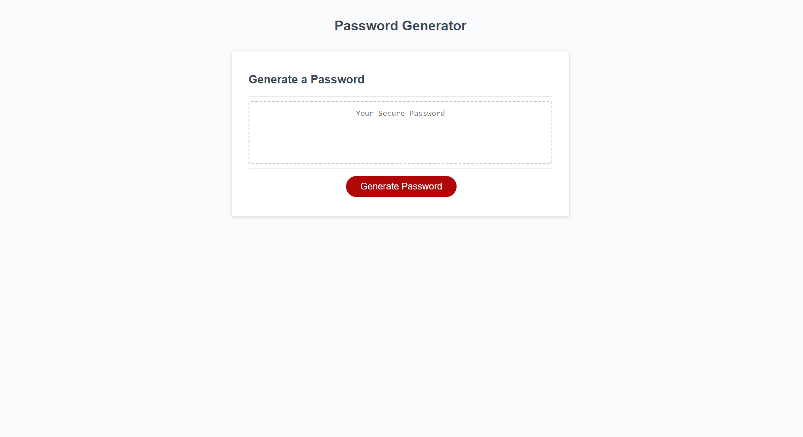

# <random-password-generator>

## Description

This project is a ramdonized password generator. It first asks hoe long you want the password to be. It then confirms if you want to use letters, numbers, and/or special characters. 

## Installation

Nothing is required for installation. 

## Usage

Simply click the link to the Github page, and click the "generate password" button to create your random password. 

Links below:
https://rnahill.github.io/random-password-generator/
 
https://github.com/rnahill/random-password-generator

[Screenshot of Random Password Generator Site](./Develop/screenshot-password-generator.png)
    

## Credits

I used online resources like W3 Schools, and I made an appointment and worked through the project with a tutor.

## License

MIT License